# Moodify by Stevens

**Team:** Goh Pei Jia, Coshin Lee, Looi Yu Zhi  
**Problem Statement:** Stress & Workload Manager  
**Video Presentation:** [Unlisted YouTube Link]  
**Presentation Slides:** [[Public Link](https://www.canva.com/design/DAHU3nlrMM4/a4z6HpJW9CrQOJzlVh4Ccg/edit)]

# 1. Project Overview

**The Problem.**  
Students are not running out of time — they are running out of capacity.

A student may have classes, assignments, meetings, personal commitments and deadlines packed into the same week, yet most productivity tools only ask one question: “What do you need to do?”

They rarely ask the more important question: “Can you realistically handle all of this right now?”

Because workload is spread across calendars, tasks and personal responsibilities, students often do not realise they are overloaded until stress has already built up. Even when they know they are overwhelmed, deciding what to postpone, when to rest, and how to reorganise the week still requires additional mental effort.

Existing calendar and productivity applications are good at organising time, but they usually treat every hour equally. They do not combine the student's actual workload with how stressed the student feels, and they rarely take the next step of helping rebalance the schedule.


**Our Solution.**  
Moodify flips the script, it's **not** another productivity tracker, but it's a personal capacity and recovery assistant. By fusing objective calendar data with real, subjective stress signals, Moodify reveals what a student can truly handle, and steps in before burnout hits, not after. It reads the full picture of a student's plate, checks in on how they're actually feeling, and turns that into real action. Deferring low-stakes tasks, carving out recovery time, and rebalancing brutal days. All wrapped in an **immersive**, ***pixel-art virtual room** that makes self-care feel like **play**, not chore.


**Feature-set:**

- **Calendar management** with local events, Google Calendar connection, sync, and `.ics` import/export.
- **Automatic workload classification** into Cognitive, Social, and Recharge categories.
- **Objective load calculation** based on the duration and type of scheduled activities.
- **Daily check-in and mood tracking** to capture the subjective side of stress.
- **Capacity dashboard** fusing objective load (45%) and subjective stress (55%) into a single signal.
- **Load Shedder** that finds safer opportunities to move flexible, lower-consequence activities.
- **AI Recovery Scheduler** that looks for available time and recommends short recovery blocks.
- **AI Timetable Suggester** that proposes alternative timing while respecting conflicts, deadlines, fixed events, and past/completed activities.
- **Conversational AI companion** supporting typed or voice input for workload, mood, reflection, and planning conversations.
- **Pixel-Art Virtual Room** An interactive PixiJS game room where each piece of furniture opens a different wellness feature
- **Social Room** Multiplayer pixel-art room with real-time chat for peer connection
- **Planning-aware calendar actions** where the AI can ask for missing plan details, propose calendar actions, and let the user choose **Moodify only** or **Moodify + Google** before saving.
- **Diary and mood reflection support** for normal conversations, while dedicated planning-mode conversations can be kept out of diary reflection.
- **Desktop companion** packaged through Electron, giving Moodify a presence beyond the browser experience.
- **Stress Assessment Quiz** Comprehensive 10-question survey for deeper self-assessment
- **Ambient Soundscapes** Rain, forest, ocean, piano, and lo-fi background audio

- **Boundary Guard** AI-drafted message templates for declining or deferring commitments
**Task Batching** Groups small errands into efficient back-to-back time blocks
- **Sleep Proxy Estimator** Infers sleep windows from calendar gaps without manual logging
- **Deadline Density Flag** Looks ahead 3 days and flags unusually heavy days
- **Guided Breathing Pacer** Four breathing techniques (Balance, Relax, Calm, Release) with session tracking
- **Recovery Streak Tracker** Tracks consecutive days with completed recovery blocks


##### The intended before/after impact is simple:

> **Before Moodify:** “I know I am busy, but I do not know what is causing the pressure or what I can safely change.”  
> **After Moodify:** “I can see my workload, connect it to how I feel, and take a specific action without losing control of my calendar.”

Moodify is initially designed around students, but the same capacity-management model can later extend to interns, early-career workers, project teams, and other people managing multiple commitments. The current web + cloud-database architecture also provides a practical path to support more users without redesigning the core product.

# 2. Ideation & Process

## 2.1 Ideas We Considered

Every distinct idea we generated during ideation, why it was kept or dropped, with the chosen ideas listed first.

| Idea | Why it was dropped / kept |
| --- | --- |
| **Capacity Gauge combining objective load + subjective stress  (Chosen)** | **Kept.** Understanding not just how full a student’s schedule is, but how heavy it actually feels. Combining workload and stress gives a much more meaningful picture of whether the student is approaching overload.|
| **AI-powered schedule rebalancing (Load Shedder + Timetable Suggester) (Chosen)** | **Kept.** Detecting stress is not enough if the user still has to solve everything alone. Moodify can suggest safer ways to move flexible activities, reduce overloaded days, and show the impact before the user approves any change. |
| **Interactive pixel-art virtual room as the main interface (Chosen)** | **Kept** We wanted stress management to feel less clinical and more approachable. The pixel-art environment and virtual companion give Moodify a warmer personality, making it feel more like a supportive space than another productivity dashboard. |
| **Daily 1–5 stress check-in (Chosen)** | **Kept** Calendar data can show how busy someone is, but it cannot fully show how they feel. A quick daily check-in gives Moodify the personal signal needed to compare actual workload with perceived stress.|
| **Google Calendar sync with automatic event classification (Chosen)** | **Kept** Students already manage much of their life through calendars, so asking them to re-enter everything creates unnecessary friction. Moodify can bring calendar events into one place and organise them into workload categories while still allowing users to review and control changes. |
| **Guided breathing exercises with session tracking (Chosen)** | **Kept** Sometimes the best response to stress is not reorganising the whole week, but helping the user recover in the moment. Breathing sessions provide a simple and immediate recovery tool within the same experience.|
| **Reflections diary with sentiment analysis (Chosen)** | **Kept** Numbers alone cannot explain everything a student is going through. The diary allows users to reflect more naturally, while Moodify can use the conversation or reflection to identify mood patterns and create a more complete view of their wellbeing. |
| **Social peer rooms with real-time chat (Chosen)** | **Kept** Stress can feel more difficult when students feel isolated. A lightweight social space gives users a sense of connection without turning Moodify into a full social-media platform. |
| **Boundary Guard (AI-drafted decline/defer messages) (Chosen)** | **Kept** Sometimes workload grows because students find it difficult to say no or ask for more time. Moodify can generate simple decline or defer messages in different tones, helping users protect their time without having to figure out the wording themselves.|
| **AI Organizer through chat (Chosen)** | **Kept** A conversational AI that allows users to chat naturally through voice or text, express their thoughts, feelings, and tasks, and receive supportive responses. It can also understand relevant information from the conversation and help organise it into the user's calendar or diary, reducing the need for manual input. |
| **Interactive Companion Character (Chosen)** | **Kept** A friendly virtual companion that appears in a separate desktop window when the Moodify webpage is inactive, allowing users to interact with features such as music and the focus timer outside the main webpage. |
|**Pure chatbot therapist / mental health diagnosis tool** | **Dropped** We did not want Moodify to pretend to be a therapist or diagnose mental-health conditions. Instead, the system focuses on workload, stress awareness, planning and recovery, while leaving professional diagnosis to qualified experts.|
|**Full LMS integration (Canvas/Moodle)** | **Dropped for now** It could improve academic workload tracking, but integrating multiple LMS platforms would add too much technical and institutional complexity for the current scope. Google Calendar already captures a large part of the student’s daily schedule.|
|**Wearable sync (Apple Health / Google Fit)** | **Dropped for now** Biometric signals such as sleep or activity could improve accuracy, but wearable APIs would increase development complexity. For the current version, Moodify uses lighter signals such as calendar patterns, check-ins and a sleep proxy instead. The current backend already includes a calendar-based sleep proxy.|
|**Social media–style feed / posting system** | **Dropped** A feed could easily become another distraction and attention loop, which works against Moodify’s purpose. We preferred a smaller social experience focused on support rather than engagement metrics.|
|**Competitive leaderboard / gamification scoring** | **Dropped** Ranking students by stress, productivity or “wellness” could create unnecessary comparison. Moodify focuses more on personal progress and recovery rather than competing with other users.|

## 2.2 Ideation Boards

[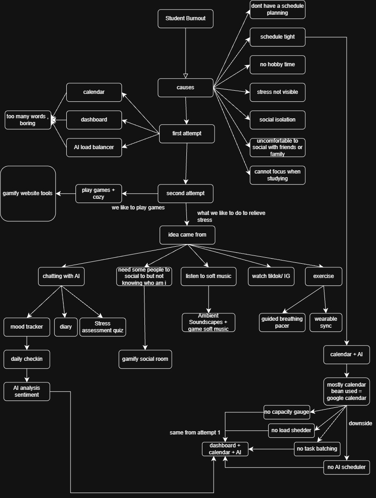](docs/mindmap.jpeg)

This map traces our thinking from the root problem down to the final feature set: **Student Burnout** breaks into root causes (no schedule planning, tight schedules, no hobby time, invisible stress, social isolation, discomfort socialising, inability to focus) and into our **first attempt** — a plain calendar + dashboard + AI load balancer. The underlying idea was sound, but the plain presentation tested as "too many words, boring," which pushed a **second attempt** built around gamified, cozy interaction — branching into chatting with AI, needing safe social connection, soft music, and exercise. Those branches map directly onto shipped features (mood tracker, diary, Stress Assessment Quiz, daily check-in with AI sentiment analysis, gamified Social Room, Ambient Soundscapes, Guided Breathing Pacer). The bottom-right loop then checks the calendar-only approach on its own: once we leaned mostly on Google Calendar as the data source, we flagged the downside — no Capacity Gauge, Load Shedder, Task Batching, or AI Scheduler — and looped back to the **same conclusion as attempt one**: Calendar + Dashboard + AI is still the right core, just carried inside the gamified interface instead of a plain one, and extended with the capacity/load features the calendar-only version was missing.

## 2.3 Mentor Consultation

| Date | Mentor | Feedback Received | What Was Changed |
|---|---|---|---|
| 10-09-2026 | Iris Yan Ning | 1. **Prevent all widgets too bulky**<br><br>2. **Allow user to hide the navigation bar**<br><br>3. **Add on more interaction object**<br><br>4. **Make the toggle icon in game more obvious** | 1. **Nav buttons restyled** with shrink-0, tighter padding, centered single-row horizontal layout that scrolls sideways instead of wrapping.<br><br>2. New **isNavHidden toggle state** added to App.jsx — a ≡/X button now shows/hides the entire Quick Hub nav row.<br><br>3. **Hover tooltips + glow halos** on every interactive sprite (icons, TV, radio, plant, settings). Dog is now clickable and barks (dog-bark.mp3). Girl character is clickable and opens a companion chat. Cursor changes to pointer on all hotspots.<br><br>4. **Added a yellow outline and name tag** to each clickable object when the user hovers over it. |
| 11-09-2026 | Zach Khong | 1. **Add on Lofi music**<br><br>2. **Add on AI chatbot, let AI chatbot to guide user how to release stress**<br><br>3. **Make the character inside the website becomsystem interactive** | 1. **Radio zone still exists** and triggers onFeature('radio'), but the radio overlay was simplified (no more overlay panel for radio — it just triggers the sound modal directly). The sound/ambient system was already in place.<br><br>2. New **AgentChatView.jsx** added — an AI chat modal titled "Moodify Assistant" with subtitle "a space to think out loud". New **agent.js** service added for backend communication. Accessible by clicking the girl character or via the modal system.<br><br>3. The **girl character is now fully interactive** — clicking her opens the AI companion chat (onCompanion callback). A hover halo + tooltip ("Chat with Moodify") follows her as she walks. A desktop companion window (companion/, CompanionCharacter.jsx) was also added with a reading animation. |

# 3. Design & Prototype

**UI Prototype:** 

| Key screen | What the interaction demonstrates |
| --- | --- |
| [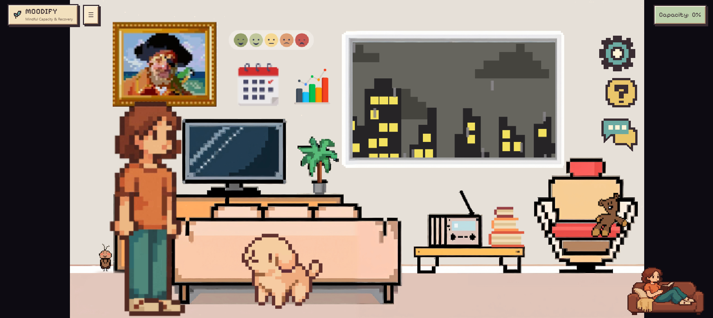](docs/UI/main_page.png) | An interactive pixel-art space that makes wellness feel like play, replacing clinical menus with clickable objects. |
| [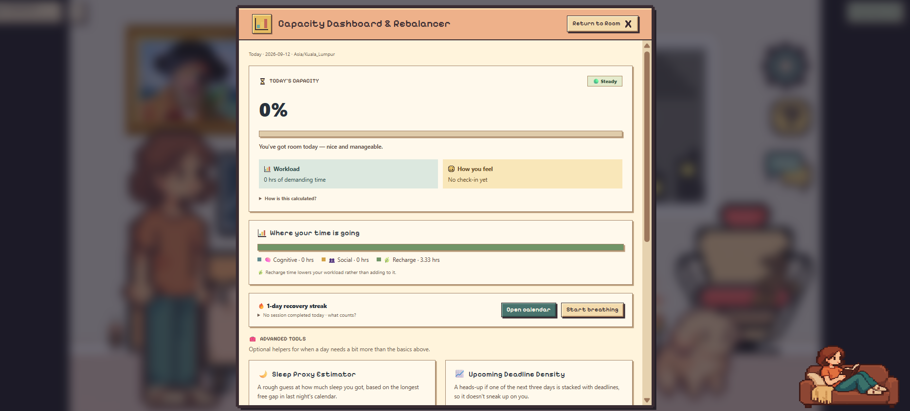](docs/UI/dashboard.png) | Capacity, workload, mood/check-in, and immediate status at a glance. |
| [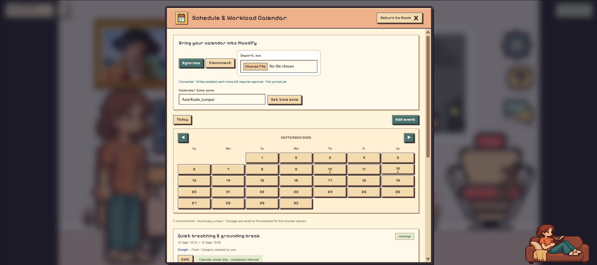](docs/UI/calendar.png) | Uses your schedule as an objective workload baseline, organising flexible and fixed events to help safely rebalance overloaded days. |
| [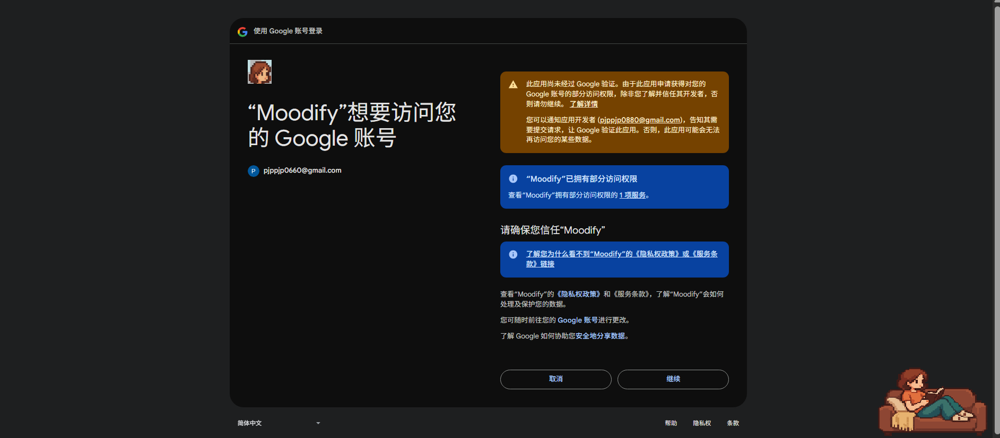](docs/UI/google_sync.png) | Connects your existing life securely. Moodify analyses your real events while keeping you in full control of any schedule changes. |
| [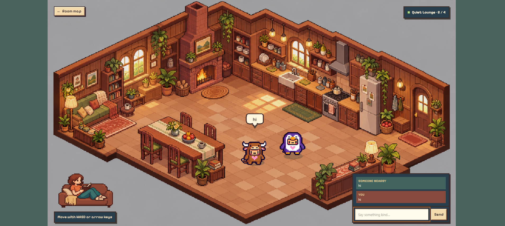](docs/UI/chat_room.png) | A lightweight multiplayer lounge offering a supportive, low-pressure space for students to connect and reduce isolation. |
| [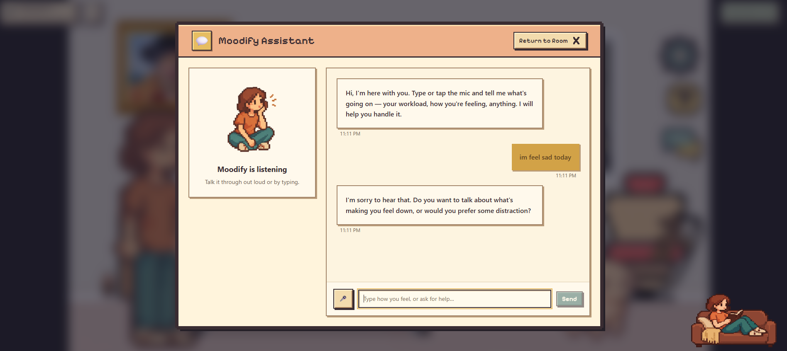](docs/UI/ai_chat.png) | A conversational companion to think out loud, helping translate feelings into practical recovery. |
| [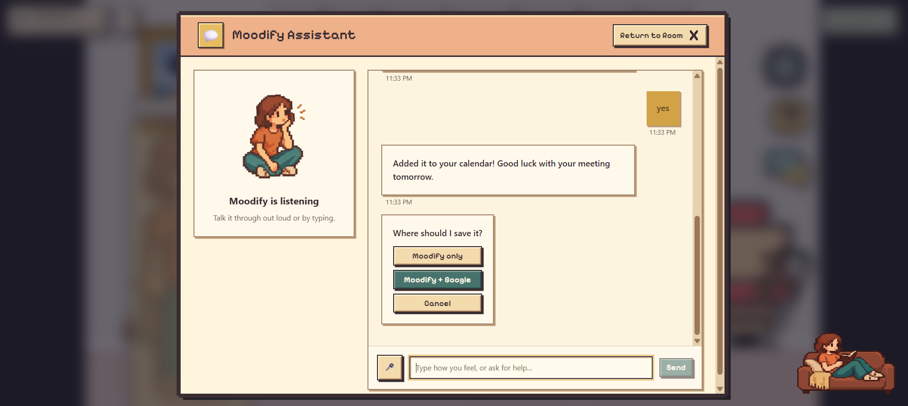](docs/UI/ai_schedule.png) | Turns natural conversation into proposed calendar events. The AI structures your plan, but you always control where it gets saved. |
| [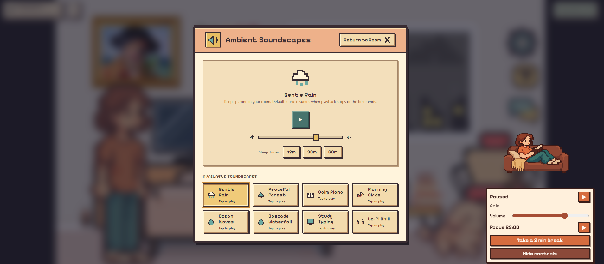](docs/UI/ambient_music.png) | Built-in background audio and focus timers to tune out distractions and sustain a healthy work rhythm. |
| [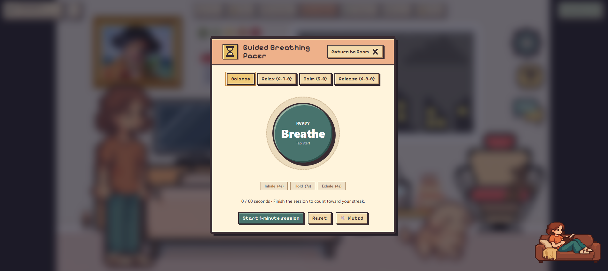](docs/UI/breathe.png) | Integrated breathing exercises that provide immediate, in-the-moment recovery to help lower stress without leaving the app. |
| [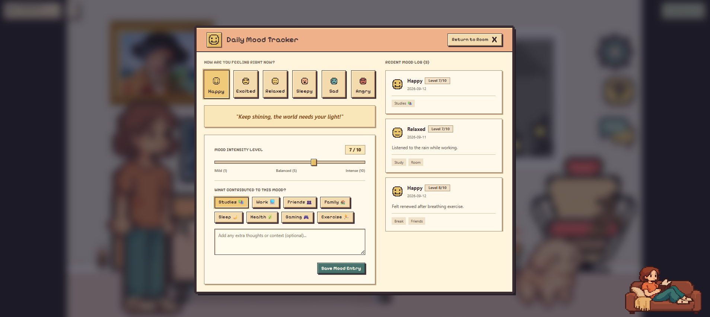](docs/UI/mood_tracker.png) | Captures the subjective side of stress—emotions and triggers—to measure how a schedule actually feels. |
| [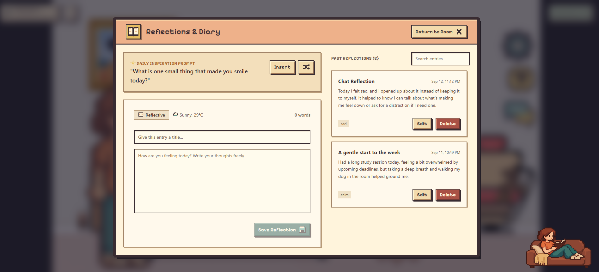](docs/UI/diary.png) | Reflection loop connecting conversations to diary/mood tracking while keeping dedicated planning conversations separate. |
| [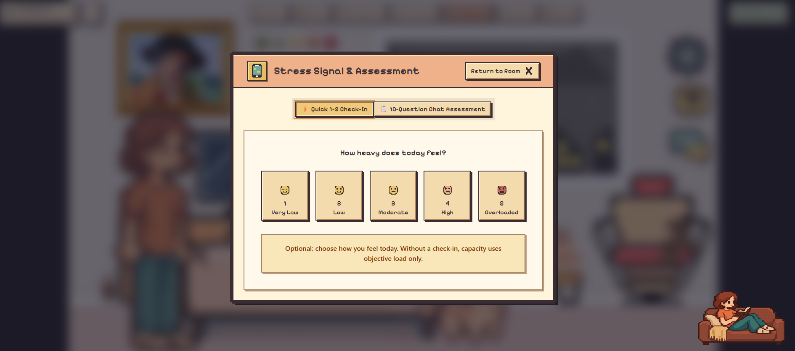](docs/UI/stress.png) | A quick 1–5 daily check-in that measures perceived heaviness, combining subjective feelings with objective calendar load. |
| [](docs/UI/companion.png) | Standalone Electron desktop companion — stays available when the main tab is inactive, with its own reading animation and quick controls for music and the focus timer. |

# 4. What Makes It Different

Moodify's novelty is not one isolated feature. It comes from how multiple signals and actions are connected into one controlled loop.

| Area | Typical standalone approach | Moodify's twist |
| --- | --- | --- |
| **Calendar** | Shows when events happen. | Treats calendar data as an objective workload signal, identifies safer schedule changes, and can **sync supported events with Google Calendar** so users can manage plans across both systems. |
| **Mood / stress tracking** | Records how the user feels. | Connects subjective stress with actual scheduled load to estimate used capacity and give a more realistic view of whether the user is becoming overloaded. |
| **AI chat** | Gives general advice. | Acts more like a **human-style companion** that can chat naturally, understand what the user is trying to plan, ask for missing details, and help turn the conversation into a schedule. Once the plan is clear, it can propose adding the event into Moodify Calendar and, if the user chooses, sync it to Google Calendar. |
| **Schedule automation** | Either manual editing or opaque auto-scheduling. | Uses recommendations plus explicit user approval. The AI can help users plan tasks through conversation, then turn that plan into calendar actions instead of leaving the advice only inside the chat. |
| **Recovery** | Generic breathing or wellness content. | Searches actual free time and inserts recovery into the same schedule that created the pressure, making recovery part of the user’s real routine rather than a separate wellness feature. |
| **Diary / reflection** | User manually writes entries. | Normal AI conversations can be **concluded into a diary reflection and mood record automatically**, so users do not need to rewrite what they already discussed. Dedicated planning conversations can be excluded so the diary stays focused on emotions and reflection rather than calendar logistics. |
| **Companion experience** | Web page only. | Extends the same product identity into an Electron desktop companion for a more persistent, interactive presence. |

The standout product idea is the **closed-loop relationship between detection and action**:

**Moodify does not stop at “you look stressed.” It connects workload + feelings, explains the pressure, proposes a practical change, and keeps the user in control of whether that change reaches their real calendar.**


# 5. Technical Architecture & Feasibility

**Tech stack**

| Layer | Current technology | Why it fits the project | Constraints / trade-offs |
| --- | --- | --- | --- |
| **Frontend** | React 19 + Vite | Fast component-based development and responsive interaction for calendar, chat, dashboard, mood, diary, and recovery views. | Browser compatibility must be considered for features such as speech recognition. |
| **Styling** | Tailwind CSS + custom CSS / Pixelify Sans | Supports fast responsive UI work while maintaining Moodify's soft pixel-inspired visual identity. | The team must keep spacing, typography, and component patterns consistent as more screens are added. |
| **Interactive graphics** | PixiJS | Supports richer visual/companion experiences where canvas-style rendering is useful. | Adds frontend bundle complexity compared with standard DOM-only UI. |
| **Backend** | Node.js 24 + Express 5 | Matches the JavaScript frontend ecosystem and provides straightforward API routes for calendar, check-in, proposals, AI features, Google OAuth, and persistence. | Serverless deployment requires careful handling of cold starts, environment variables, cookies, and database connections. |
| **Database** | PostgreSQL through `pg` | Durable cloud-friendly persistence; current store keeps user state in JSONB and session records in PostgreSQL. | Production use needs managed backups, migration discipline, connection limits, and secure configuration. |
| **Calendar integration** | Google Calendar API + Google OAuth + `.ics` import/export | Lets Moodify use real schedules instead of requiring all events to be re-entered manually. `.ics` provides a provider-independent fallback. | OAuth setup is environment-specific; Google write-back must remain permissioned and conflict-aware. |
| **Date / timezone handling** | Luxon | Useful for correct local-day calculations and scheduling across time zones. | Calendar logic still requires careful handling of DST, overnight events, and local-day boundaries. |
| **ICS parsing** | `node-ical` | Handles imported calendar files and recurring-event information. | Large or unusual recurrence patterns require limits and validation. |
| **AI providers** | Groq, OpenRouter, and Google Gemini with configurable provider and fallback | Reduces dependency on a single provider and supports conversational/planning features while allowing local fallback when AI is unavailable. | Provider rate limits, model availability, latency, and quotas remain external constraints. |
| **Security for Google tokens** | AES-256-GCM encryption | Protects stored provider tokens before database persistence. | The encryption key must be kept stable and secret; losing it requires reconnection. |
| **Deployment** | Vercel-compatible frontend/backend setup | Practical for hackathon deployment and quick iteration. | Environment variables, OAuth callback URLs, CORS/origin settings, and database availability must be configured separately for deployed mode. |
| **Desktop companion** | Electron + electron-builder | Reuses web technologies while providing a downloadable desktop companion. | Desktop packaging increases release size and adds OS-specific testing requirements. |

The current source also includes several feasibility safeguards: bounded AI request timeouts, provider cooldown/fallback behavior, explicit parsing/validation of AI output, Google token encryption, session handling, calendar conflict checks, and separate user approval before supported write actions. Core load calculations and scheduling constraints remain deterministic rather than depending entirely on an LLM, which makes the most important workload logic easier to explain and test.

**System architecture diagram**
[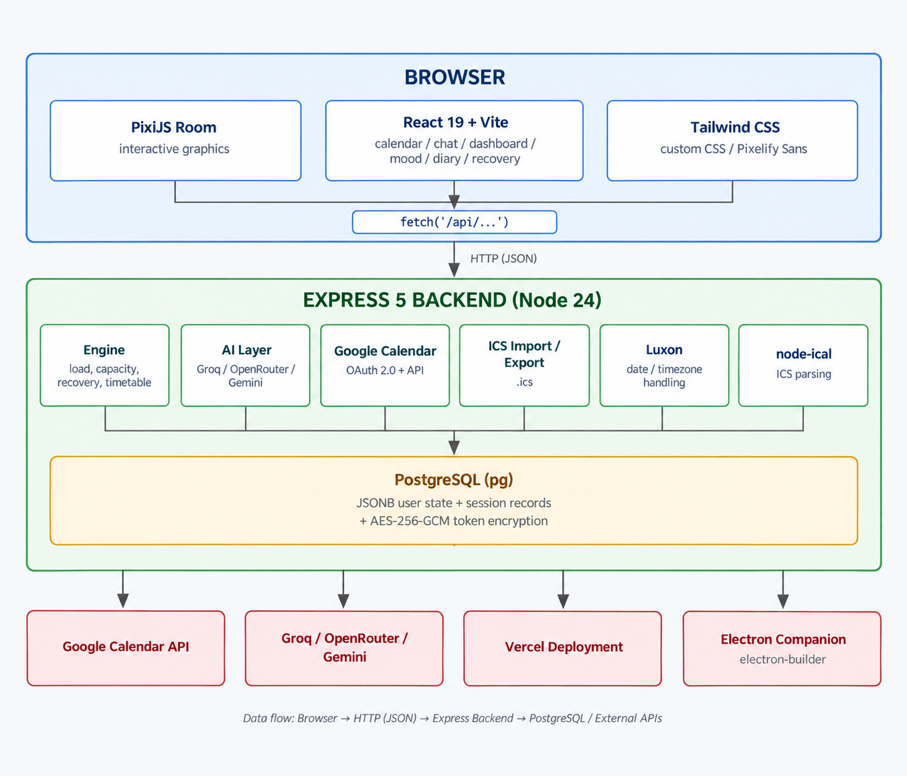](docs/system_architecture.png)

### 1. Browser (Client Layer)

**PixiJS Room (WebGL):** Renders the interactive pixel-art virtual room and companion-style visual experience.  

**React 19 + Vite:** Provides the main interface for calendar, chat, dashboard, mood, diary, planning, and recovery features.  

**Tailwind CSS + Custom CSS / Pixelify Sans:** Provides the responsive design system while maintaining Moodify's pixel-inspired visual identity.  

*All client components communicate with the backend through `fetch('/api/...')` over HTTP (JSON).*

---

### 2. Backend — Express 5 (Node.js 24)

**Engine:** Core logic for workload calculation, capacity scoring, recovery recommendations, task movement, and timetable rebalancing.  

**AI Layer:** Routes conversational and planning requests across Groq, OpenRouter, and Google Gemini with configurable provider fallback.  

**Google Calendar Integration:** Uses OAuth 2.0 and Google Calendar API for calendar synchronisation and permission-based write-back.  

**ICS Import / Export:** Handles `.ics` calendar ingestion and export for users outside the Google Calendar ecosystem.  

**Date / Timezone Handling:** Uses Luxon for local-day calculations, scheduling, time zones, overnight events, and date boundaries.  

**ICS Parsing:** Uses `node-ical` to process calendar files, recurring events, recurrence exceptions, and timezone information.  

**Data Layer:** PostgreSQL through `pg`, with user application state stored in JSONB and session records persisted separately.  

**Token Security:** Google OAuth tokens are encrypted using AES-256-GCM before being stored in PostgreSQL.

---

### 3. External Services & Deployment

**Google Calendar API:** Supplies real calendar events used for workload analysis and supports approved schedule changes.  

**Groq / OpenRouter / Gemini API:** External AI providers supporting Moodify's conversational, planning, and recommendation features.  

**PostgreSQL / Neon:** Provides persistent cloud-based storage for user state and browser sessions.  

**Vercel:** Hosts the deployed frontend and backend for public access and rapid hackathon deployment.  

**Electron Companion:** Reuses Moodify's web technologies to provide a desktop companion experience through Electron and `electron-builder`.

---

**Data flow:** Browser → HTTP (JSON) → Express Backend → PostgreSQL / External APIs

**Build plan & scope**
### 1. A Complete Capacity Loop — From Calendar to Action

A calendar can tell you **what is scheduled**. It cannot tell you whether the person behind it is coping.

Moodify connects both sides.

Users can sync Google Calendar, import a `.ics` file, or create plans directly inside Moodify. Events are analysed as **Cognitive, Social, or Recharge**, converted into an objective workload score, and combined with the user's daily stress check-in to produce a live **Capacity Score**.

The result is a simple but complete loop:

> **Calendar → Measure Load → Check In → Understand Capacity → Take Action → Recover**

Instead of waiting until a student is already overwhelmed, Moodify helps surface pressure while there is still time to change the schedule.

---

### 2. Three Interventions That Actually Change the Schedule

Moodify does not stop at saying:

> *"You look stressed. Take a break."*

It turns overload detection into practical actions, while keeping the user in control.

- **Load Shedder** — identifies flexible, lower-consequence tasks that can be moved away from overloaded periods.
- **AI Recovery Scheduler** — finds a real free slot in the user's schedule and proposes a suitable recovery activity.
- **AI Timetable Suggester** — evaluates upcoming days and proposes healthier task arrangements while respecting deadlines, conflicts, fixed commitments, and existing events.

Suggestions can show the impact before they are accepted, helping the user understand **why** a change is useful.

> **Moodify does not just detect overload — it helps reduce it.**

---

### 3. Planning Through Conversation — Not Another Form to Fill

Planning does not always begin inside a calendar.

Sometimes it begins with:

> *"I need to finish my assignment tomorrow."*

or:

> *"I want to exercise after class."*

Moodify's AI assistant can recognise when the user is trying to make a plan, ask only for the missing details such as **date, time, or duration**, and turn the conversation into a structured calendar event.

The assistant also distinguishes between two situations:

- **Dedicated planning conversation** — focused on creating a plan and does not automatically become a diary entry.
- **Natural conversation** — if the user casually mentions a plan while reflecting on their day, the conversation can still contribute to diary context while the plan is captured separately.

This creates a more natural flow:

> **Conversation → Understanding → Plan → Calendar**

rather than forcing users to repeatedly open forms and manually enter every detail.

---

### 4. Google Calendar Without Losing Moodify Plans

Connecting Google Calendar should add context — not erase what the user already created.

Moodify keeps locally created plans independent from Google Calendar events.

After Google Calendar is connected, existing Moodify plans remain available, and the user can decide whether a plan should stay:

- **Moodify only**, or
- **Moodify + Google Calendar**

Google write-back remains permission-based, so users stay in control of what enters their real calendar.

This allows Moodify to work as a planning layer **on top of** the user's existing calendar instead of replacing it.

---

### 5. A Pixel-Art World That Makes Wellness Feel Less Clinical

Most productivity and wellness tools open with charts, forms, and menus.

Moodify opens with a room.

The PixiJS-powered pixel-art environment turns different objects into entry points for real features:

- Calendar and workload management
- Mood tracking
- Diary and reflection
- Guided breathing
- Ambient sound
- Recovery tools
- AI companion chat
- Planning assistance

Animated characters, environmental effects, and interactive objects make the experience feel closer to a personal digital space than a traditional productivity dashboard.

The visual design is not just decoration.

> If managing stress feels like another task, users may avoid it.  
> Moodify tries to make checking in feel like entering a space they actually want to return to.

---

### 6. A Wellness Toolkit Around the Core Scheduling Engine

Moodify does not treat stress as a calendar problem alone.

Supporting features help users understand, process, and recover from pressure:

- **Daily Stress Check-In** — captures how the workload actually feels.
- **Mood Tracker** — records emotional state, intensity, and contributing factors.
- **Reflection & Diary** — supports structured reflection beyond numeric scores.
- **Guided Breathing** — provides quick recovery activities when stress is high.
- **Ambient Soundscapes** — supports focus and relaxation.
- **Recovery Tracking** — encourages consistent recovery habits.
- **AI Companion** — gives users a conversational space for reflection, planning, and recovery guidance.
- **Capacity Visualisation** — shows how schedule load and subjective stress combine.

These features support the main capacity-management loop instead of existing as disconnected wellness tools.

---

### 7. Beyond Suggestions — Moodify Remembers and Acts

The current version of Moodify is no longer just a temporary local prototype.

User state and sessions are persisted through **PostgreSQL**, allowing plans, calendar state, check-ins, and application data to survive beyond a single page refresh or local demo session.

The system also supports:

- Google Calendar OAuth integration
- `.ics` calendar import/export
- Persistent Moodify plans
- Permission-based Google Calendar write-back
- AI-assisted conversational planning
- Cloud deployment
- Desktop companion support through Electron

This moves Moodify from a collection of prototype screens toward a connected system where:

> **what the user says, how they feel, and what is on their calendar can work together.**

---

**Planning & Scope**

With a three-person team (Goh Pei Jia, Coshin Lee, Looi Yu Zhi) working within a hackathon timeframe, we scoped Moodify around one connected loop — calendar data, stress check-ins, and AI-driven action — rather than spreading effort across every possible wellness feature. Features that would have added real value but needed disproportionate time, external permissions, or specialised data (LMS integration, wearable sync, longer-term predictive forecasting, full account management, deeper personalisation) were deliberately deferred rather than half-built, so the core capacity-and-recovery loop could be finished, tested, and actually deployed. The project is live on Vercel today (frontend + backend), which reflects that the chosen scope was realistic for the team and timeframe available.

---

### 8. What We're Deliberately Leaving Out — For Now

Moodify is designed as a **workload and recovery assistant**, not a medical diagnosis system.

Some ideas were deliberately kept outside the current hackathon scope because they require significantly more integration, permissions, testing, or specialised data.

Future directions include:

- **LMS Integration** — Canvas, Moodle, and other academic platforms
- **Wearable Integration** — sleep, activity, HRV, and other physiological signals
- **Longer-Term Predictive Forecasting** — predicting overloaded periods before they occur
- **Advanced Account Management** — full login, recovery, and cross-device identity
- **Deeper Personalisation** — learning longer-term workload and recovery patterns

These features matter, but trying to build everything would weaken the core experience.

For this version, the priority is clear:

> **Understand what a student is carrying, recognise pressure earlier, and turn that understanding into an action they can actually take.**

**Build Plan — Next 3 Weeks**

With the core capacity-and-recovery loop already built and deployed, the next building phase's top priority is **Wearable Integration** (Apple Health / Google Fit) — bringing in real sleep, activity, and physiological signals to replace the current calendar-based Sleep Proxy Estimator with actual biometric data, tightening the accuracy of the Capacity Score. Alongside this, the AI-driven parts of the other deferred items — such as LMS-aware workload classification and longer-term predictive forecasting — will be refined rather than fully built out, sharpening the intelligence behind existing features without expanding scope. Advanced account management and deeper personalisation stay on the backlog beyond this phase.

## How to Run Moodify

Moodify can be tested in two ways:

1. **Deployment Mode (Recommended)** — For judges or users who want to access the hosted application directly.
2. **Local Mode** — For development and testing.

### Option 1 — Deployment Mode (Recommended)

**A. Web Version (Full App)**
You can access the live, deployed web version of Moodify without any installation:
- **Frontend App:** [https://moodify-frontend-kappa.vercel.app/](https://moodify-frontend-kappa.vercel.app/)
- **Backend API:** [https://moodify-backend-navy.vercel.app/](https://moodify-backend-navy.vercel.app/)

**B. Desktop Companion (.exe)**
We also offer a standalone desktop companion app. *Note: This `.exe` version focuses specifically on the interactive AI companion feature (the animated girl character).*
1. Navigate to the **Releases** section on our GitHub repository.
2. Locate the latest release titled **Moodify Companion v1.0.0**.
3. Download the provided `.exe` file.
4. Open the `.exe` file to launch the Moodify Companion on your desktop.

#### Important: Google Calendar in Deployment Mode

For Google Calendar synchronization to work in the deployed environment, the OAuth credentials in Google Cloud Console must be configured with the production frontend URL (`https://moodify-frontend-kappa.vercel.app`) as the authorized origin, and the backend URL (`https://moodify-backend-navy.vercel.app/api/auth/google/callback`) as the authorized redirect URI.

---

### Option 2 — Local Mode

1. Clone the repository to your local machine.
2. Navigate into the `backend` directory and run `npm install`.
3. Create a `.env` file in the `backend` directory using the format below (replace placeholders with your actual keys):
   ```env
   PORT=3001
   APP_ORIGIN=http://localhost:5173
   GOOGLE_REDIRECT_URI=http://localhost:3001/api/auth/google/callback
   GOOGLE_CLIENT_ID=your_google_client_id_here
   GOOGLE_CLIENT_SECRET=your_google_client_secret_here
   DATABASE_URL=your_neon_postgres_connection_string
   TOKEN_ENCRYPTION_KEY=your_64_character_hex_string_here
   
   # AI Provider Settings
   AI_ENABLED=true
   AI_PROVIDER_ORDER=gemini,groq,openrouter
   GEMINI_API_KEY=your_gemini_api_key_here
   GEMINI_MODEL=gemini-3.6-flash
   GROQ_API_KEY=your_groq_api_key_here
   GROQ_MODEL=qwen/qwen3.6-27b
   OPENROUTER_API_KEY=your_openrouter_api_key_here
   OPENROUTER_MODEL=openrouter/free
   ```
4. Start the backend server by running `npm run dev` (it will run on `localhost:3001`).
5. Navigate into the `frontend` directory and run `npm install`.
6. Start the frontend development server by running `npm run dev` (it will run on `localhost:5173`).

#### Important: Google Calendar in Local Mode

When testing locally, ensure your Google Cloud Console OAuth settings allow `http://localhost:3001/api/auth/google/callback` as an Authorized Redirect URI. If your OAuth app is in "Testing" mode, you will need to manually add test users in the console before they can log in.

---

### Deployment vs Local Mode

| | Deployment Mode | Local Mode |
|---|---|---|
| Frontend | Vercel (`moodify-frontend-kappa`) | `localhost:5173` |
| Backend | Vercel (`moodify-backend-navy`) | `localhost:3001` |
| Database |  PostgreSQL / Neon | PostgreSQL / Neon |
| Google OAuth | Production callback URL | Local callback URL |
| Best for | Judge demo / public access | Development / testing |

---